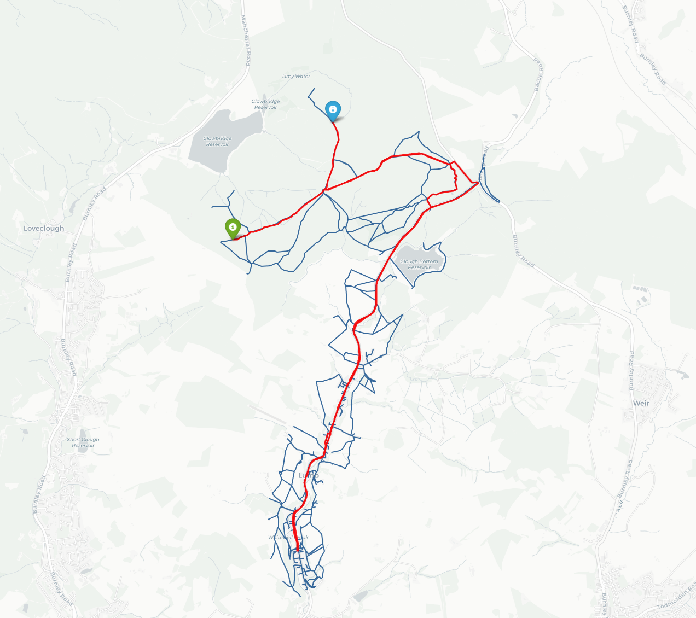

# Strava to FOSS (notebooks)

[](https://opensource.org/licenses/AGPL-3.0)
[](https://python.org)
[](https://github.com/psf/black)

A short and snappy collection of Jupyter Notebooks to turn Strava activity data in geo-spatial data you can interrogate, and blend it with OpenStreetMap data for recommendations and plotting.

 <!-- Optional -->

## ✨ Features

- **Strava Export**: OAuth flow and API export /activities
- **GeoPandas**: Converting Strava activity data to geo-spatial data that can be interrogated
- **osmx**: OpenStreetMap integration for blending other data with the Strava data
- **Plotting**: Leaflet mapping and other plotting features, seen above and deployed on the repo
- **Deployment**: Deployment of the maps to Github Pages

## 📦 Installation

### Prerequisites
- Python 3.9+
- Conda (miniconda)

### ⚙️ Configuration

> NB. Assuming you cloned the repo already, right?

#### 1. Create .env file 

```
STRAVA_C_ID=
STRAVA_C_SECRET=
STRAVA_REDIRECT=http://localhost:8080
STRAVA_C_AUTH_CODE=
STRAVA_C_ACCESS_CODE=

```

Open the `./strava_data.ipynb` next for more instruction. *Some may require that you start running the Jupyter Notebook

#### 2. Create conda env from environment.yml

```
conda env create --name strava_data_analysis --file=environment.yml
```

## 🚀 Usage

Start Conda

```
sh ./scripts/conda_init.sh
```

Start Jupyter Notebooks

```
jupyter notebook
```

Open `strava_data.ipynb` first and work through step until you downloaded `activities.geojson`

---

Follow notebook instructions, from there

`./pyrosm.ipynb` is WIP

## 📚 Documentation

More docs within the notebooks.

Key sections:
- [OSM](./osm.ipynb)
- [Strava](./strava_data.ipynb)
- [Pyrosm](./pyrosm.ipynb)

## 🤝 Contributing

Contributions not accepted at this point.

## 🔍 Testing

Not implemented

## 🙏 Acknowledgements

Docs from:
- [GeoPandas](https://geopandas.org/en/stable/docs.html)
- [osmnx](https://osmnx.readthedocs.io/en/stable/index.html)
- [Pyrosm](https://pyrosm.readthedocs.io/en/latest/reference.html#pyrosm.pyrosm.OSM)
- [Leeds University posts](https://udsleeds.github.io/openinfra/articles/osm-python.html)

## Author

Alan Ionita @2025

## 📜 License
This project is licensed under the GNU Affero General Public License v3.0 - see the LICENSE file for details.

AGPL requires that:
- All modifications must be disclosed
- Network services using this code must release their source
- Derivative works must use same license
